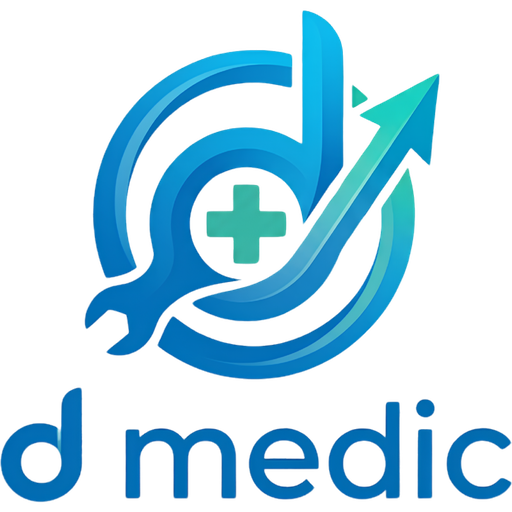

<div align="center">



# D-Medic

**Tanı koyan Windows optimizasyon aracı / Diagnose-first Windows optimizer**

*Önce dinler, sonra konuşur — sistemi tarar, her bulguyu önceliklendirir, onayınla uygular*
*Scans first, then acts — prioritizes every finding and applies only with your consent*

🌐 **TR · EN** — Bu README iki dillidir / This README is bilingual (English collapsibles below each section)

</div>

## 🎬 Demo

<div align="center">

> 📸 Ekran görüntüleri ve demo videosu yakında / Screenshots and demo video coming soon — `docs/media/`

</div>

<div align="center">

[](./LICENSE)


**🛡 Güvenlik / Security**

[](./src-tauri/tauri.conf.json)
[](#-vizyon)
[](#-öne-çıkan-özellikler--key-features)
[-blue?logo=windows)](https://learn.microsoft.com/en-us/windows/win32/wmisdk/wmi-start-page)

</div>

---

## 📌 Kısaca

D-Medic, Windows 11 kullanıcıları için **tanılama tabanlı**, açık kaynaklı bir sistem optimizasyon aracıdır. Kör optimizasyon yapmaz — önce sistemi tarar, her bulguyu **OTOMATİK / KILAVUZ / MÜMKÜN DEĞİL** olarak etiketler, öncelik + tahmini kazanım gösterir, **sadece onayınla** uygular.

**Tauri v2** ile yazıldığı için — Rust core + WebView2 — Electron tabanlı alternatiflerden çok daha hafif (~10 MB binary). **Bağımlılık sıfır, tamamen offline** — hiçbir veri dışarı çıkmaz.

**Kişisel kullanım için** geliştirilen, **MIT lisanslı** bir D Brand projesidir. Windows 11 22H2 ve üzeri, 2–8 GB RAM'li HDD/SSD makineler hedeflenir. Manifest seviyesinde tek seferlik `requireAdministrator` UAC ile çalışır.

<details>
<summary>🇬🇧 At a glance (English)</summary>

D-Medic is a **diagnose-first**, fully open-source system optimizer for Windows 11. It never optimizes blindly — it scans the system first, tags every finding as **AUTOMATIC / GUIDED / NOT POSSIBLE**, shows priority + estimated gain, and applies changes **only with your consent**.

Built on **Tauri v2** — Rust core + WebView2 — it is far lighter than Electron-based alternatives (~10 MB binary). **Zero dependencies, fully offline** — no data ever leaves the machine.

It is a **personal-use**, **MIT-licensed** D Brand project. It targets Windows 11 22H2+ machines with 2–8 GB RAM on HDD/SSD. Runs under a single manifest-level `requireAdministrator` UAC elevation.

</details>

---

## 🆕 Yenilikler

> v0.1 iskelet serisinde D-Medic'in çekirdek tanılama motoru ve iki güçlü araç eklendi.

- 🩺 **30 tanılama kontrolü** — RAM/VBS, SMART, disk doluluk, fragmentasyon, servisler, telemetri, UWP bloat, startup, BCD/EFI, Windows Update, TPM, Secure Boot, güç planı, hibernation, pagefile, DNS, BSOD geçmişi, SFC/DISM…
- 🗑️ **Program Kaldırıcı (Revo tarzı)** — Win32 + UWP envanteri, programın kendi kaldırıcısı, kaldırma sonrası registry + dosya kalıntı taraması (güven skorlu), karantina + `.reg` export ile **geri-alınabilir** temizlik
- 🧩 **Özel Defrag Motoru (NTFS IOCTL)** — `FSCTL_*` ile küme-seviyesi parça analizi, **canlı cluster haritası**, SSD'de full defrag otomatik devre dışı
- 🎯 **Profil sistemi** — Basit / Orta / Agresif / Özel
- ↩️ **3 katmanlı rollback** — System Restore + `reg export` + servis durumu JSON snapshot
- 📚 **21 kılavuz** — tümü Microsoft Learn / Support kaynaklı
- 🔍 **Çok-kaynaklı doğrulama** — tartışmalı aksiyonlar için kaynak rozetleri
- 🪵 **Dev-only logger köprüsü** — frontend hataları dev terminaline akar

<details>
<summary>🇬🇧 What's new (English)</summary>

> The v0.1 scaffold series adds D-Medic's core diagnostics engine plus two powerful tools.

- 🩺 **30 diagnostic checks** — RAM/VBS, SMART, disk usage, fragmentation, services, telemetry, UWP bloat, startup, BCD/EFI, Windows Update, TPM, Secure Boot, power plan, hibernation, pagefile, DNS, BSOD history, SFC/DISM…
- 🗑️ **Revo-style Uninstaller** — Win32 + UWP inventory, the program's own uninstaller, post-uninstall registry + filesystem leftover scan (confidence-scored), **reversible** cleanup via quarantine + `.reg` export
- 🧩 **Custom Defrag Engine (NTFS IOCTL)** — cluster-level fragmentation analysis via `FSCTL_*`, a **live cluster map**, full defrag auto-disabled on SSDs
- 🎯 **Profile system** — Basic / Balanced / Aggressive / Custom
- ↩️ **3-layer rollback** — System Restore + `reg export` + service-state JSON snapshot
- 📚 **21 guides** — all sourced from Microsoft Learn / Support
- 🔍 **Multi-source verification** — source badges for contentious actions
- 🪵 **Dev-only logger bridge** — frontend errors stream to the dev terminal

</details>

---

## 🎯 Vizyon

D-Medic, "her sorunu temizleyiciyle çöz" yaklaşımının tersini benimser: **önce tanı, sonra tedavi.** Pazardaki rakipler (Winutil, CCleaner, BleachBit, O&O ShutUp10) ya script tabanlı ya Electron'dur ve çoğu kör optimizasyon önerir. D-Medic farkı: **tanılama → öncelik sıralı plan → onaylı uygulama** akışı.

Her aksiyon için tahmini kazanım + risk skoru gösterilir, her yıkıcı işlem öncesi otomatik snapshot alınır, ve geri alınabilirlik korunur. Hiçbir şey kullanıcı görmeden değişmez.

<details>
<summary>🇬🇧 Vision (English)</summary>

D-Medic takes the opposite stance to "clean everything with a cleaner": **diagnose first, then treat.** Competitors (Winutil, CCleaner, BleachBit, O&O ShutUp10) are either script-based or Electron, and most suggest blind optimization. D-Medic's difference is the **diagnose → priority-ordered plan → consented apply** flow.

Every action shows an estimated gain + risk score, every destructive operation takes an automatic snapshot first, and reversibility is preserved. Nothing changes without the user seeing it.

</details>

---

## ✨ Öne Çıkan Özellikler / Key Features

### 🩺 Tanılama / Diagnostics

- **30 kontrol**, hızlı tarama (~saniyeler) ve derin tarama (SFC + DISM, dakikalar)
- Her bulgu: **öncelik** (Kritik/Yüksek/Orta/Düşük) + **tahmini kazanım** + **aksiyon tipi** (Otomatik / Kılavuz / Mümkün Değil)
- WMI native sorgular (windows-rs) — PowerShell spawn maliyeti yok
- Canlı tarama ilerlemesi (event tabanlı X/Y adım göstergesi)

<details>
<summary>🇬🇧 Diagnostics (English)</summary>

- **30 checks**, quick scan (~seconds) and deep scan (SFC + DISM, minutes)
- Each finding: **priority** (Critical/High/Medium/Low) + **estimated gain** + **action type** (Automatic / Guided / Not Possible)
- Native WMI queries (windows-rs) — no PowerShell spawn cost
- Live scan progress (event-based X/Y step indicator)

</details>

### 🗑️ Program Kaldırıcı / Uninstaller (Revo parity)

- **Win32 + UWP envanteri** — registry Uninstall dalları (winreg) + `Get-AppxPackage`
- Programın **kendi kaldırıcısını** çalıştırır, sonra geride kalanı tarar
- **Kalıntı taraması**: registry + dosya sistemi, güven skoru (Güvenli / Olası / Düşük)
- **Karantina + `.reg` export** ile geri-alınabilir silme (14 gün saklama)

<details>
<summary>🇬🇧 Uninstaller (English)</summary>

- **Win32 + UWP inventory** — registry Uninstall keys (winreg) + `Get-AppxPackage`
- Runs the program's **own uninstaller**, then scans for what's left behind
- **Leftover scan**: registry + filesystem, confidence-scored (Safe / Probable / Possible)
- Reversible removal via **quarantine + `.reg` export** (14-day retention)

</details>

### 🧩 Defrag Motoru / Defrag Engine (custom IOCTL)

- NTFS `FSCTL_GET_NTFS_VOLUME_DATA` (geometri), seek-penalty IOCTL ile **SSD tespiti**
- `FSCTL_GET_VOLUME_BITMAP` → **canlı cluster haritası**, `GET_RETRIEVAL_POINTERS` → parça analizi
- `FSCTL_MOVE_FILE` ile konsolidasyon (NTFS-journaled, veri-güvenli)
- **SSD'de full defrag devre dışı**, MFT zone taşınmaz, iptal edilebilir

<details>
<summary>🇬🇧 Defrag engine (English)</summary>

- NTFS `FSCTL_GET_NTFS_VOLUME_DATA` (geometry), **SSD detection** via the seek-penalty IOCTL
- `FSCTL_GET_VOLUME_BITMAP` → **live cluster map**, `GET_RETRIEVAL_POINTERS` → fragment analysis
- Consolidation via `FSCTL_MOVE_FILE` (NTFS-journaled, data-safe)
- **Full defrag disabled on SSDs**, MFT zone never moved, cancellable

</details>

### 🎯 Profiller / Profiles

- **Basit / Orta / Agresif / Özel** — her profil farklı işlem setini içerir
- Plan ekranında manuel seçim + tahmini toplam kazanım

<details>
<summary>🇬🇧 Profiles (English)</summary>

- **Basic / Balanced / Aggressive / Custom** — each profile carries a different action set
- Manual selection + estimated total gain in the Plan screen

</details>

### ↩️ Rollback (3 katman / layers)

- **Checkpoint-Computer** (System Restore) + **`reg export`** (HKCU/HKLM Software) + **servis durumu JSON snapshot**
- Her yıkıcı aksiyon öncesi otomatik snapshot
- Sınır: silinen UWP geri gelmez (Microsoft Store yönlendirmesi)

<details>
<summary>🇬🇧 Rollback (English)</summary>

- **Checkpoint-Computer** (System Restore) + **`reg export`** (HKCU/HKLM Software) + **service-state JSON snapshot**
- Automatic snapshot before every destructive action
- Limit: removed UWP apps can't be restored (redirected to Microsoft Store)

</details>

### 📚 Kılavuzlar / Guides

- **21 adım-adım kılavuz**, tümü Microsoft Learn / Support kaynaklı
- "Mümkün Değil / Kılavuz" bulguları otomatik buraya bağlanır (TPM, Secure Boot, MBR→GPT, SMART disk değişimi…)

<details>
<summary>🇬🇧 Guides (English)</summary>

- **21 step-by-step guides**, all sourced from Microsoft Learn / Support
- "Not Possible / Guided" findings link here automatically (TPM, Secure Boot, MBR→GPT, SMART disk replacement, …)

</details>

### 🔒 Güvenlik / Security

- **Tamamen offline** — sıfır ağ bağımlılığı, hiçbir telemetri yok
- Tek seferlik `requireAdministrator` UAC (per-komut UAC spam yok)
- Yıkıcı işlemler önce snapshot alır; kaldırıcı silmeleri karantinaya taşır
- `tracing` günlük rotasyon (max 7 dosya) — `%APPDATA%\D-Medic\logs\`

<details>
<summary>🇬🇧 Security (English)</summary>

- **Fully offline** — zero network dependency, no telemetry
- One-time `requireAdministrator` UAC (no per-command UAC spam)
- Destructive operations snapshot first; uninstaller deletions move to quarantine
- `tracing` log rotation (max 7 files) — `%APPDATA%\D-Medic\logs\`

</details>

### 🚀 Mimari / Architecture

- **Tauri v2** — Rust core + WebView2, ~10 MB binary
- WMI native (windows-rs) + tek-spawn PowerShell batch dispatch
- SIMD parsing (`simd-json`, `memchr`, `blake3`), `opt-level = 3` release
- Pinia store + composable + IPC komut katmanı (Vue 3 + TypeScript)

<details>
<summary>🇬🇧 Architecture (English)</summary>

- **Tauri v2** — Rust core + WebView2, ~10 MB binary
- Native WMI (windows-rs) + single-spawn PowerShell batch dispatch
- SIMD parsing (`simd-json`, `memchr`, `blake3`), `opt-level = 3` in release
- Pinia store + composable + IPC command layer (Vue 3 + TypeScript)

</details>

---

## 🛠️ Teknoloji / Tech Stack

| | |
|---|---|
| **Tauri v2** | Rust core + WebView2 |
| **Vue 3** | TypeScript + Vite + Pinia |
| **windows-rs / wmi** | native WMI + FSCTL IOCTL (defrag) |
| **winreg / walkdir** | registry + dosya sistemi kalıntı taraması / leftover scan |
| **simd-json / memchr / blake3** | hızlı parse + hash / fast parse + hashing |
| **tracing** | yapılandırılmış log + rotasyon / structured logging + rotation |

### 📐 Mimari Belgeler / Architecture Documents

Ürün vizyonu ve detaylı tasarım için: [D-Medic-Teknik-Dokuman-v1.1.docx](./D-Medic-Teknik-Dokuman-v1.1.docx).

---

## 🗺️ Yol Haritası / Roadmap

| Sürüm / Version | Hedef / Target | İçerik / Content |
|---|---|---|
| **v0.1.x** | ✅ iskelet / scaffold | 30 tanılama + profiller + rollback + 21 kılavuz + kaldırıcı + defrag motoru |
| **v0.5** | 1–2 ay / months | Gerçek pencere doğrulaması, defrag mod ayrışması, program ikonları, junk cleaner |
| **v1.0** | 3–4 ay / months | İlk binary release, code signing (SignPath FOSS), VirusTotal taraması, dokümantasyon |
| **v1.x** | — | Zamanlanmış tarama, rapor export, ek tanılama dalları |

---

## 📥 Kurulum / Installation

> ⚠️ Henüz binary release yok (pre-alpha). Şimdilik kaynaktan derlenir / No binary release yet — build from source for now.

**Gereksinimler / Requirements:** Node.js 20+ & pnpm, Rust (stable), Visual Studio Build Tools 2022 (C++ workload), Windows 11 22H2+, WebView2 (Win11'de yerleşik / built-in).

```bash
pnpm install          # bağımlılıklar / dependencies
pnpm tauri:dev        # geliştirme penceresi / dev window (UAC: Evet / Yes)
pnpm tauri:build      # üretim binary / production binary (NSIS installer)
```

<details>
<summary>🇬🇧 Notes (English)</summary>

D-Medic ships under a manifest-level `requireAdministrator` elevation, so `pnpm tauri:dev` triggers a UAC prompt — click **Yes**. The first Cargo build takes a few minutes; subsequent incremental builds are fast.

</details>

---

## 🚀 İlk Adımlar / Quick Start

Uygulamayı ilk açtığında deneyebileceğin **5 hızlı şey**:

1. **Pano → Hızlı Tarama** → sistemini saniyeler içinde tarar, öncelikli bulgular çıkar
2. **Plan** → bir profil seç (Basit/Orta/Agresif) veya bulguları manuel işaretle → **Yürüt**
3. **Araçlar → Program Kaldır** → bir programı kaldır + geride kalan registry/dosya izlerini temizle (karantinaya alınır, geri alınabilir)
4. **Araçlar → Disk Birleştir** → HDD'de **Analiz Et** → canlı cluster haritası + parçalanma raporu → Birleştir
5. **Geçmiş** → her snapshot'tan geri dön (rollback)

<details>
<summary>🇬🇧 Quick Start (English)</summary>

1. **Dashboard → Quick Scan** → scans your system in seconds, surfaces prioritized findings
2. **Plan** → pick a profile (Basic/Balanced/Aggressive) or check findings manually → **Execute**
3. **Tools → Uninstall** → remove a program + clean leftover registry/file traces (quarantined, reversible)
4. **Tools → Defragment** → on HDD, hit **Analyze** → live cluster map + fragmentation report → defrag
5. **History** → roll back from any snapshot

</details>

---

## 🛡️ Güvenlik / Security & Sistem Gereksinimleri / System Requirements

> 🇹🇷 İlk binary release ile birlikte tüm installer'lar **VirusTotal**'da taranıp sonuçlar buraya eklenecek; code signing (SignPath FOSS) başvurusu planlanıyor.
> 🇬🇧 With the first binary release, all installers will be scanned on **VirusTotal** and results posted here; code signing (SignPath FOSS) is planned.

### 💻 Sistem Gereksinimleri / System Requirements

- Windows 11 22H2 veya üzeri / or newer (x64)
- 2–8 GB RAM hedef / target; ~10 MB disk
- WebView2 runtime (Win11'de yerleşik / built-in on Win11)
- Yönetici yetkisi / Administrator privileges (manifest `requireAdministrator`)

---

## 🤝 Katkı / Contributing

Bu proje **kişisel bir Windows optimizasyon projesidir** ve topluluk katkı kapsamı bilinçli olarak dar tutulmuştur. Çekirdek mimari tek elden ilerliyor — ama topluluğun değer katabileceği şeritler açık.

| ✅ Kabul edilen / Accepted | ❌ Şu an kabul edilmeyen / Not currently accepted |
|---|---|
| 🐛 Bug raporu / Bug reports | 🏗️ Mimari / refactor PR'ı / PRs |
| 💡 Feature **fikri / ideas** (Issue) | ✨ Çekirdek özellik kodu PR'ı / Core feature code PRs |
| 🌍 Dil paketi / Language packs (`src/locales/<kod \| code>.json`) | |
| 📚 Kılavuz JSON'u / Guide JSONs (`src-tauri/resources/guides/`) | |

<details>
<summary>🇬🇧 Contributing (English)</summary>

This is a **personal Windows optimization project** and the community contribution scope is intentionally narrow. Core architecture is owned by the maintainer — but lanes are open for language packs and guide JSONs. See the table above.

</details>

---

## 🎨 D Brand Ailesi / D Brand Family

D-Medic, D Brand ailesinin Windows bakım ayağıdır. Aile üyeleri "Denizhan" adından ilham alır:

| Ürün / Product | Platform | Açıklama / Description |
|---|---|---|
| **D-Medic** | Windows | Tanı koyan sistem optimizasyon aracı / diagnose-first system optimizer *(this project, pre-alpha)* |
| **D-Terminal** | Windows | Agent-aware terminal *(pre-alpha)* |
| **D-Player** | Android | Kişisel müzik çalar, DSP motoru / personal music player with DSP engine *(in development)* |
| **DCar Launcher** | Android (Auto) | Head Unit araç içi OS katmanı / Head Unit in-car OS layer *(in development)* |
| **D-Watchtower** | — | Gözetim ve izleme platformu / surveillance & monitoring platform *(in development)* |

---

## 💖 Sponsorlar / Sponsors

D-Medic açık kaynak (MIT) ve sürekli geliştiriliyor. Sponsorluk doğrudan **yeni uygulama geliştirmeye** dönüşür — D Brand ailesinde sırada birçok fikir var.

[](https://github.com/sponsors/AmrasElessar)

<details>
<summary>🇬🇧 Sponsors (English)</summary>

D-Medic is open source (MIT) and actively developed. Sponsorships translate directly into **new app development** — many ideas in the D Brand queue.

</details>

<!-- SPONSORS:HERO -->
<!-- Hero tier sponsorları buraya pinlenir / are pinned here -->
<!-- /SPONSORS:HERO -->

<!-- SPONSORS:LIST -->
<sub>Henüz sponsor yok / No sponsors yet. **İlk sponsor sen ol / Be the first →** [github.com/sponsors/AmrasElessar](https://github.com/sponsors/AmrasElessar)</sub>
<!-- /SPONSORS:LIST -->

---

## ❤️ D-Medic'i destekle / Support D-Medic

<table>
<tr>
<td align="center" width="33%">

### ⭐ Star at / Star it

GitHub'da **Star** projeyi başkalarına da görünür kılar.
Make the project visible to others.

[⭐ github.com/AmrasElessar/d-medic](https://github.com/AmrasElessar/d-medic)

</td>
<td align="center" width="33%">

### 💖 Sponsor ol / Sponsor

Geliştirme aktif, D Brand ailesinde sırada birçok uygulama var.
Active development, many apps in the D Brand queue.

[💖 github.com/sponsors/AmrasElessar](https://github.com/sponsors/AmrasElessar)

</td>
<td align="center" width="33%">

### 🐛 Geri bildirim / Feedback

Bug ve fikirlerini Issue olarak aç.
Open bugs and ideas as Issues.

[🐛 Issues](https://github.com/AmrasElessar/d-medic/issues)

</td>
</tr>
</table>

---

## 📜 Lisans / License

MIT © Orhan Engin OKAY — bkz / see [LICENSE](./LICENSE)
